# Jingrui Feng (jf4446) - database systems project part 3 - quote to policy process models

# Quote-to-policy process models

I use UML-style activity diagrams with swimlanes for the documented application workflows. These are activity diagrams rendered with Mermaid, not strict BPMN diagrams. Each diagram makes the normal path, significant extension branches, and database boundary visible.

## UC-1 Applicant obtains a quote

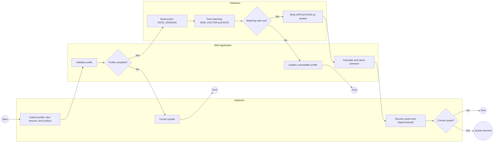

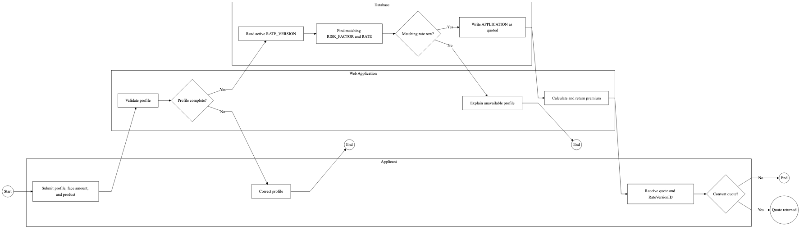

I show the application profile, face amount, and active `RATE_VERSION` lookup because the quote must use a current rate book. A successful quote writes `APPLICATION` with status `quoted`. An incomplete or unmatched profile does not create a policy, and an unconverted quote remains an application without a `Contract`.

## UC-2 Applicant converts a quote to a policy

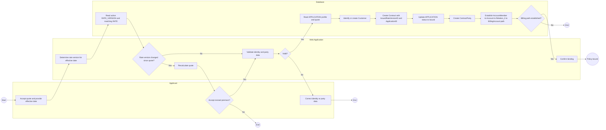

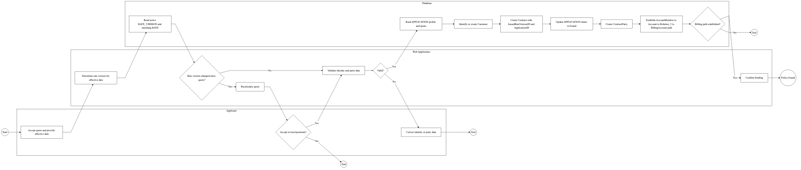

I use the changed-rate branch to make the policy-freezing rule concrete. Binding reads the persisted `APPLICATION`, writes its identifier to `Contract.ApplicationID`, and writes the version active on the effective date to `Contract.IssuedRateVersionID`. The billing branch uses the declared account path and does not create or imply a direct contract-to-invoice relationship.

## UC-3 Policyholder reports wellness participation

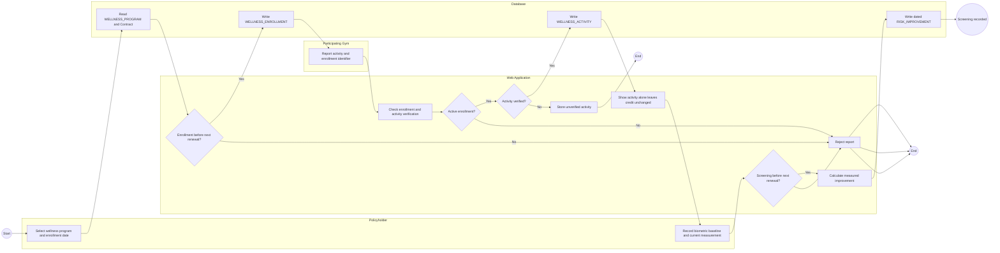

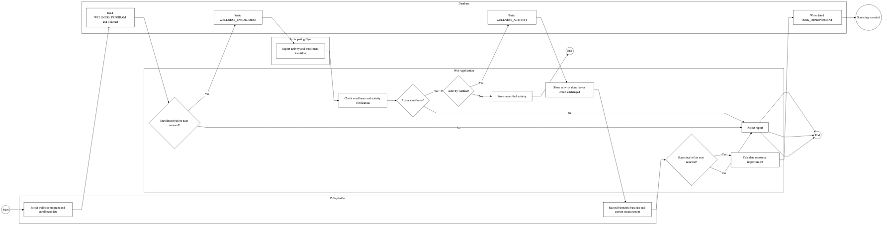

I show enrollment, verified activity, and biometric screening as separate steps. Activity records participation but leaves the credit unchanged. A dated measurement before the next renewal writes `RISK_IMPROVEMENT`, which supplies the evidence for a future renewal credit.

## UC-4 System performs scheduled rate revision

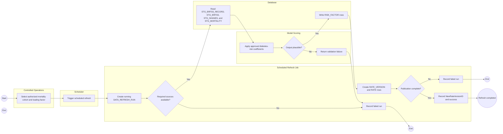

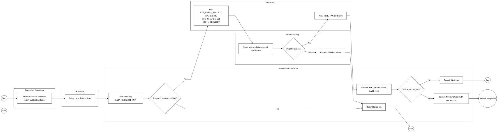

I show UC-4 as a scheduler-driven process to distinguish it from the synchronous quote path. Controlled operations can choose an authorized mortality cohort and loading factor before the job starts. The process demonstrates the asynchronous pricing mechanism through `DATA_REFRESH_RUN`, staging input, approved diabetes-risk scoring, risk-factor construction, and a separately published rate version. Failed sources, implausible model output, and failed publication never replace the existing active rate book.

## UC-5 Policy renewal is repriced with a wellness offset

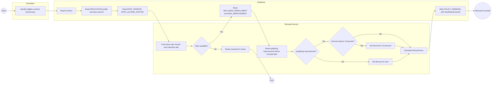

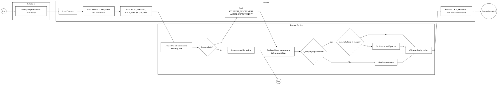

I added this diagram because it is the point where new pricing and wellness participation meet. Renewal reads the profile and face amount through `Contract.ApplicationID`, then uses `POLICY_RENEWAL.NewRateVersionID` for the version active on the renewal date. The existing contract keeps its original `IssuedRateVersionID`. Only improvement dated before renewal is considered, and the discount branch makes the 15 percent cap visible.

## Synchronous and asynchronous boundary

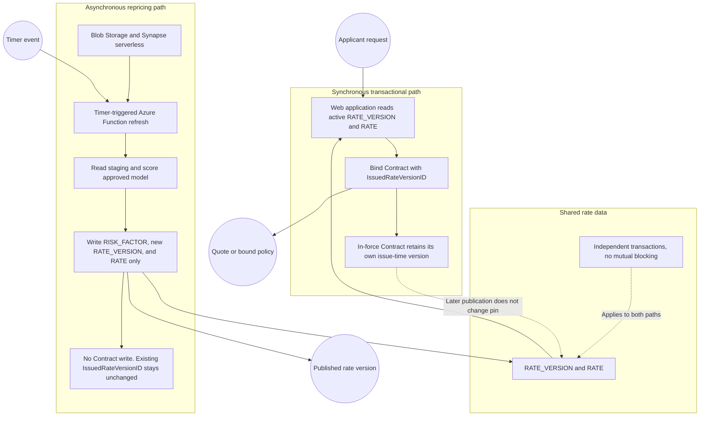

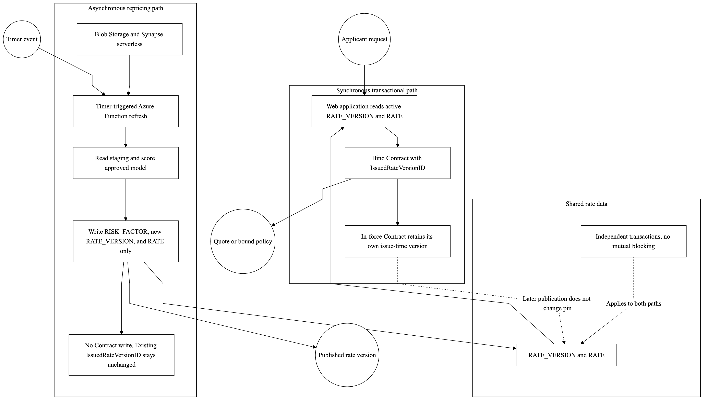

I designed this boundary diagram to show why the first two required mechanisms are properties of the design. The quote and bind path synchronously reads the active `RATE_VERSION` and `RATE`, while the timer-triggered refresh writes a new version in an independent transaction. The annotation on the asynchronous path states that it writes `RISK_FACTOR`, `RATE_VERSION`, and `RATE` only. There is no write edge from the repricing path to `Contract`, so an in-force `Contract` keeps its own `IssuedRateVersionID` after publication.

## Rendering

I rendered the PNG files from the editable Mermaid sources in `diagrams/src/` with this command pattern:

```bash
node_modules/.bin/mmdc -p diagrams/puppeteer-config.json -c diagrams/mermaid-config.json -i diagrams/src/uc1_process.mmd -o diagrams/uc1_process.png -w 1800 -H 1200 -b white
```

The same command was run once for each source file. `diagrams/mermaid-config.json` sets black borders and lines, white fills, black text, and linear connectors. `diagrams/puppeteer-config.json` sets the Chromium sandbox option needed by the local renderer.
