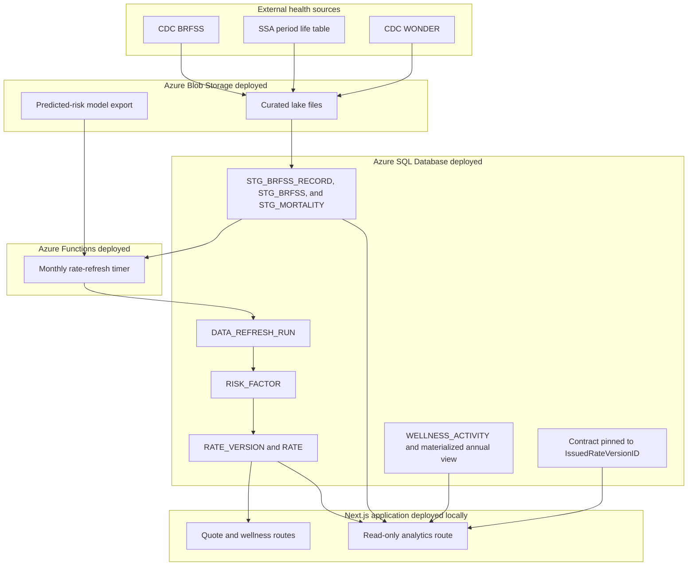
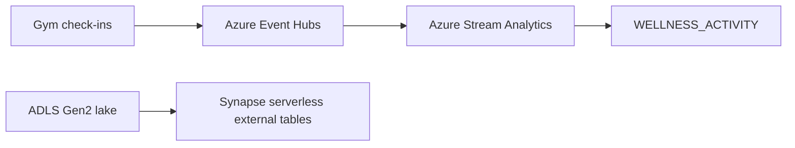

# Jingrui Feng (jf4446) - database systems project part 3 - reference architecture version two

# Reference architecture version 2

I extended the inherited reference architecture to separate deployed Part 3
components from designed future components. Azure Blob Storage, Azure SQL
Database, the physical design, Azure SQL lake queries, the rate-refresh core,
the analytics application route, and the Azure Function App are implemented.
Synapse serverless, Event Hubs, and Stream Analytics remain conceptual.

## Deployed architecture

The deployed Blob files can be read in place through Azure SQL `OPENROWSET`.
Azure SQL Database holds both warehouse data and the published rate books. The
monthly Azure Function reads Azure staging data and the Blob model export to
publish `RISK_FACTOR`, `RATE_VERSION`, and `RATE`. It has no write path to
Contract, so in-force policies remain pinned to their issued version.

The Next.js application is operated locally for the course demonstration but
reads Azure SQL when `AZURE_SQL_*` settings are present. `/admin/analytics` is
read-only and presents rate history, staging analytics, wellness participation,
and refresh audit history.

## Designed but not deployed

Synapse is not deployed because the current storage account has hierarchical
namespace disabled. Event Hubs and Stream Analytics are future state for a
continuous wellness feed, not current components.

## DIKW framing

| DIKW level | Implemented component | Meaning in this project |
|---|---|---|
| Data | Curated Blob files and `STG_BRFSS_RECORD` | Source-grain public-health records and retained source files. |
| Information | `STG_BRFSS` and `STG_MORTALITY` | Conditional prevalence and normalized mortality inputs with lineage. |
| Knowledge | Approved model export and `RISK_FACTOR` | Diabetes risk stratification and derived mortality multipliers. |
| Wisdom | `RATE_VERSION`, `RATE`, quoted rates, and renewal offsets | Published pricing decisions applied without changing existing policy rates. |

I retain the source-grain BRFSS table and the conditional summary table. This
makes the Data-to-Information transformation visible in the database rather
than hiding it in application code.
